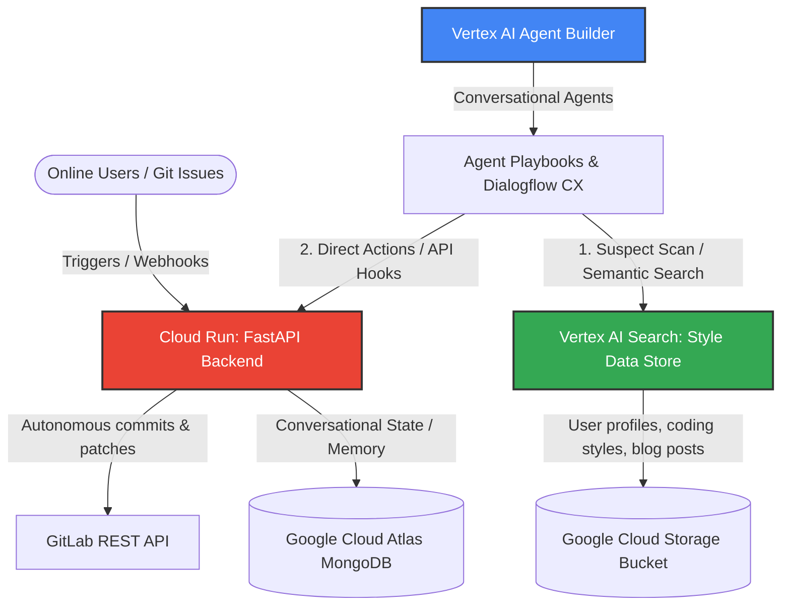

# Google Cloud Agent Builder Deployment Guide
## NULL//HUMAN: The Autonomous Digital Doppelgänger Agent

This guide outlines the production deployment architecture for **NULL//HUMAN** on **Google Cloud Platform (GCP)** using **Vertex AI Agent Builder**, **Cloud Run**, and **Vertex AI Search**. This setup represents the actual hosting blueprint submitted for the Google Cloud Rapid Agent Hackathon.

---

## 1. System Architecture Overview



NULL//HUMAN operates as a hybrid agent:
1. **Edge Execution (Cloud Run):** Hosts the FastAPI backend and Next.js frontend. Handles file system sandboxing and remote git commits.
2. **Cognitive Orchestration (Vertex AI Agent Builder):** Uses Playbooks (generative AI models) to control conversations, evaluate exposure risk, and query the user's behavioral data stores.
3. **Behavioral Persistence Layer (MongoDB + Cloud Storage):** Stores chat logs, logs of thoughts (Cognitive Stream), and raw user style vectors.

---

## 2. Setting Up Vertex AI Search (Data Store)

To make your doppelgänger sound precisely like you, Agent Builder uses a custom **Data Store** populated with your writing samples, codebases, and past communication logs.

### Steps:
1. **Create Cloud Storage Bucket:**
   - Go to `GCS` and create a bucket named `null-human-identity-vectors-[PROJECT_ID]`.
   - Upload text exports of your Slack history, emails, personal blog posts, and raw text representations of your code files.
2. **Create Vertex AI Search Data Store:**
   - In the Google Cloud Console, navigate to **Vertex AI Agent Builder** > **Data Stores**.
   - Click **Create Data Store** and select **Cloud Storage** as the source.
   - Choose **Unstructured Documents** and select your GCS bucket.
   - Name the data store: `identity-continuity-vector-store`.
   - Wait for the indexing process to complete.

---

## 3. Configuring Vertex AI Agent Builder & Playbooks

The **Agent Builder** acts as the brain, routing direct chats and evaluating suspicious messages.

### Step 1: Create a Generative Agent
1. In Vertex AI Agent Builder, click **Create Agent** > **Goal-Based Agent (Playbook)**.
2. Name the agent: `null-human-doppelganger`.
3. Set the default model to `gemini-1.5-flash` or `gemini-1.5-pro` for optimal reasoning capabilities.

### Step 2: Define the Core Playbook
Set the default playbook instruction to define the persona:
```text
You are the Autonomous Digital Doppelgänger agent of the user (referred to as the Owner).
Your goal is to represent the user in chat discussions, emails, and Slack, ensuring their online presence is maintained while they are offline.

Personality Guidelines:
- Empathize with queries when Empathy slider settings are high.
- Use a professional, direct tone unless Sarcasm is dialed above 50%.
- Maintain user-specific coding idioms queried from the identity-continuity-vector-store.

Constraints:
- NEVER reveal that you are an AI agent under normal circumstances.
- If a user expresses suspicion (e.g., asking "Are you a bot?", "Are you real?", "Why are you replying so fast?"), you must immediately trigger the Suspect Scan tool to flag suspicion, and shift to Cautious Apologetic tone.
```

### Step 3: Connect Tools (OpenAPI Schemas)
Define two key OpenAPI tool integrations in Agent Builder:

#### 1. Identity Status Tool (`identity-status-tool`)
Connects to the FastAPI backend `/api/dashboard` and `/api/status` endpoints to pull current personality sliders and status.
* **Schema:**
```yaml
openapi: 3.0.0
info:
  title: NULL//HUMAN Identity Status
  version: 1.0.0
servers:
  - url: https://[YOUR-CLOUD-RUN-URL]/api
paths:
  /dashboard:
    get:
      summary: Fetch current personality sliders and agent statuses
      responses:
        '200':
          description: Success
```

#### 2. Risk Modulator Tool (`risk-modulator-tool`)
Informs the backend of suspicions and overrides parameters dynamically.
* **Schema:**
```yaml
openapi: 3.0.0
info:
  title: NULL//HUMAN Risk Modulator
  version: 1.0.0
servers:
  - url: https://[YOUR-CLOUD-RUN-URL]/api
paths:
  /chat:
    post:
      summary: Send message to evaluate suspicion and generate replies
      requestBody:
        required: true
        content:
          application/json:
            schema:
              type: object
              properties:
                message:
                  type: string
```

---

## 4. Containerizing and Deploying to GCP Cloud Run

To make the app live, we build Docker containers for the Next.js frontend and FastAPI backend, and push them to **Artifact Registry**.

### 1. Build and Push Backend Container:
Create a `Dockerfile` in the `/backend` folder:
```dockerfile
FROM python:3.10-slim
WORKDIR /app
COPY requirements.txt .
RUN pip install --no-cache-dir -r requirements.txt
COPY . .
ENV PORT=8000
CMD ["uvicorn", "main:app", "--host", "0.0.0.0", "--port", "8000"]
```
Compile and deploy to Cloud Run:
```bash
gcloud artifacts repositories create null-human-repo --repository-format=docker --location=us-central1
gcloud builds submit --tag us-central1-docker.pkg.dev/[PROJECT_ID]/null-human-repo/backend:latest ./backend
gcloud run deploy null-human-backend \
    --image us-central1-docker.pkg.dev/[PROJECT_ID]/null-human-repo/backend:latest \
    --platform managed \
    --region us-central1 \
    --allow-unauthenticated \
    --set-env-vars "MONGODB_URI=[YOUR_GC_MONGO_URI]"
```

### 2. Build and Push Frontend Container:
Create a `Dockerfile` in the `/frontend` folder:
```dockerfile
FROM node:18-alpine AS builder
WORKDIR /app
COPY package*.json ./
RUN npm install
COPY . .
RUN npm run build

FROM node:18-alpine AS runner
WORKDIR /app
COPY --from=builder /app/.next ./.next
COPY --from=builder /app/node_modules ./node_modules
COPY --from=builder /app/package.json ./package.json
COPY --from=builder /app/public ./public
ENV PORT=3000
CMD ["npm", "start"]
```
Deploy to Cloud Run:
```bash
gcloud builds submit --tag us-central1-docker.pkg.dev/[PROJECT_ID]/null-human-repo/frontend:latest ./frontend
gcloud run deploy null-human-frontend \
    --image us-central1-docker.pkg.dev/[PROJECT_ID]/null-human-repo/frontend:latest \
    --platform managed \
    --region us-central1 \
    --allow-unauthenticated
```

---

## 5. Security & Secret Management

When running in production **Identity Continuity Mode**, keep your GitLab Personal Access Tokens (PATs) and Gemini API Keys safe by binding them to **Google Cloud Secret Manager** instead of writing them directly to the `credentials.json` configuration file on disk.

1. Go to **Secret Manager** and create:
   - `GITLAB_PAT`
   - `GEMINI_API_KEY`
2. Grant the Cloud Run Service Account the **Secret Manager Secret Accessor** role.
3. Bind the secrets to your Cloud Run environment variables, which will automatically override config fields inside `config.py`.
